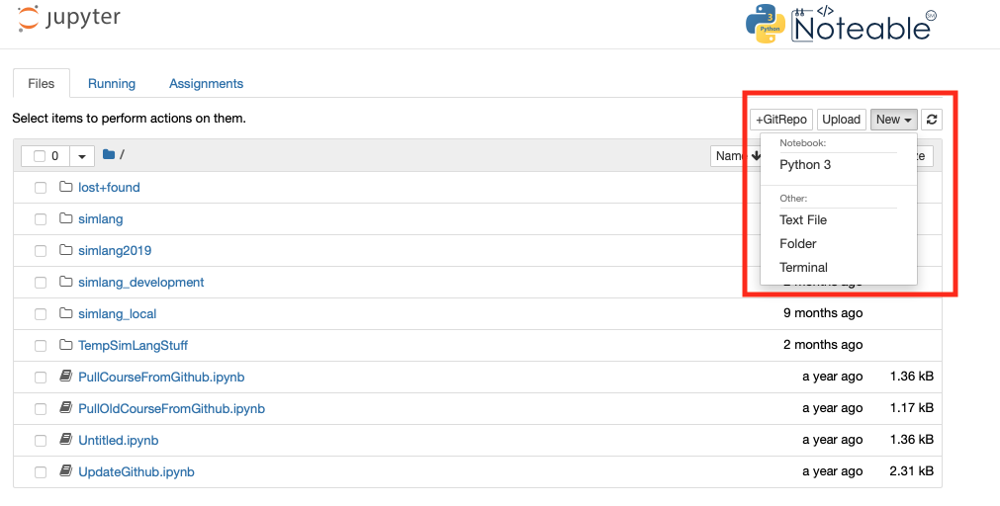
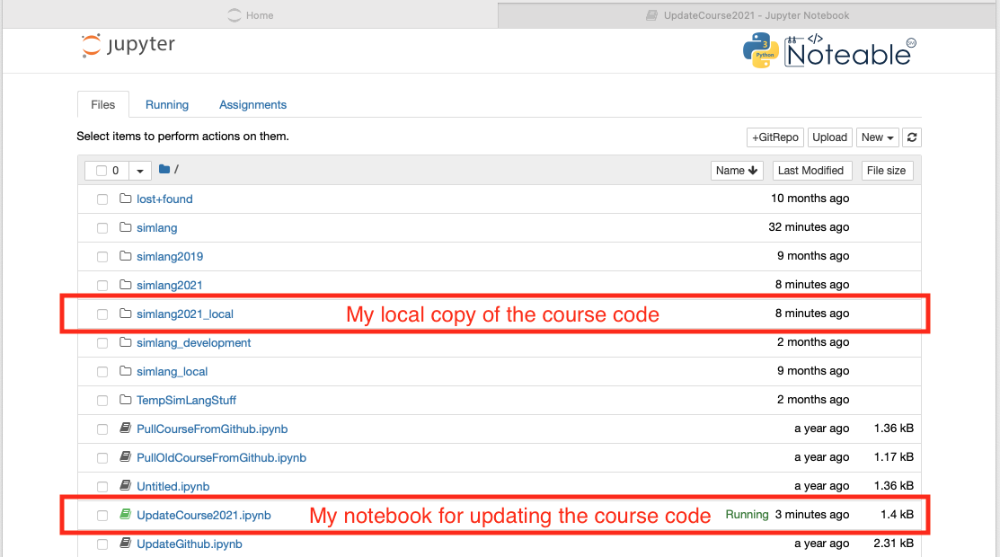

# The plan for week 2 labs

In this first lab we'll show you how to access the noteable server to work on code, how to import code from github to noteable, and then by working through the first notebook you'll learn the basics of python. If that all sounds a bit complicated, don't worry, it's fairly simple and we'll talk you through  it step by step here. And if you can't get it to work or have questions, we are available to help you in the drop-in labs on Teams.

# Logging on to noteable

All the coding for this course will be done using interactive Python notebooks, which allow us to combine text and code in a single document. The interactive Python notebooks work using a "Jupyter Server". The University of Edinburgh provides one that you can log, and we will be accessing it : [https://noteable.edina.ac.uk/login](https://noteable.edina.ac.uk/login). Once you've logged on to the noteable service you may have to either "reconnect" or "start" your server (if there is a list of options available, stay with "Standard Notebook (Python 3)").


Once you've started and connected/reconnected to the server you'll be given an interface that will let you upload notebooks and navigate the files you'll be creating.

# Getting the code from github

We are sharing the course code through github, which is a service for sharing code. The first thing you need to do for lab classes every week is to upload the latest notebooks from this github site. To do that, you need to open a new notebook that includes some code you'll use to update the files. Follow these steps:

- Click on the "new" menu.
- Select "Python 3". This will open a brand new notebook.

- In the first "cell" of the notebook, you need to enter some code that will handle the transfer from the github site.
- Copy and paste the following code into the cell:
```
!rm -rf simlang2021
!git clone https://github.com/centre-for-language-evolution/simlang2021
!mkdir -p simlang2021_local
!cp -nr simlang2021/* simlang2021_local
```

- Run this code by pressing SHIFT + ENTER. This will transfer all the current simlang2021 content into your notebook server. It copies everything into a folder called "simlang2021", and every time you execute this code it will overwrite whatever is in that folder with a clean copy of the course code, which means that any changes you make to code in that folder will be over-written each time you fetch the latest code. It also makes a "local" copy of the code in a folder called "simlang2021_local". **This is the one you should do your work in**, safe in the knowledge any changed you make won't get overwritten.
- Rename your notebook (by clicking on the "file" menu and then "rename") - call it something like "UpdateCourse".
- Save the notebook by clicking "file" and then "save and checkpoint".

Now you're done with this bit of code, so you can close that browser tab. Next time you want to add new notebooks for the course, just open the notebook "UpdateCourse.ipynb" (or whatever you called it) in the file list in the noteable Home window and run that first cell again by pressing SHIFT + ENTER.

You can now click on the "simlang2021_local" folder in the file list in the noteable Home window and open any of the notebook files that are there. If you mess anything up, you can delete the notebook you're working on, run the update course notebook again and you'll have a fresh file to work from. (But be careful, you won't be able to undo this!)


# Programming tasks for today's lab

If you go into your simlang2021_local folder you'll see several notebook files (files whose name ends in ".ipynb"). The main part of today's lab is the file lab1.ipynb - open that file by clicking on it, it'll open up a new noteable window containing more explanatory text that you can work through. Your main task for labs this week is to work through that notebook! If you need help you can come to drop-in labs on Teams and get one-on-one help, but we have also made some extra notebooks available (also in the simlang2021_local folder) which will provide you some extra help:
- lab1_notebook_intro.pynb is a brief introduction to notebooks, and showcases some of the nice stuff you can do with formatting text etc.
- lab1_answered.ipynb (when released) provides a model answer for the lab1 notebook - we have completed the code cells for you so you can see what we were expecting you to do.
- lab1_walkthrough.ipynb (when released) provides a very detailed explanation of the logic behind the model answers for the "Functions" section of the notebook.

# Re-use

This page was written by Kenny Smith, based on https://github.com/smkirby/SimLang/blob/master/README.md, written by Simon Kirby. All aspects of this work are licensed under a [Creative Commons Attribution 4.0 International License](http://creativecommons.org/licenses/by/4.0/).
